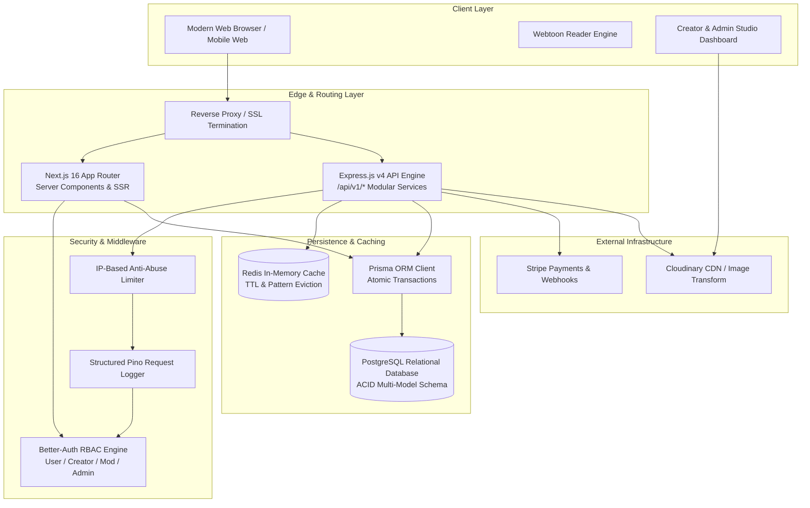
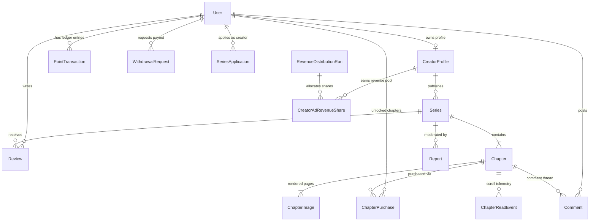
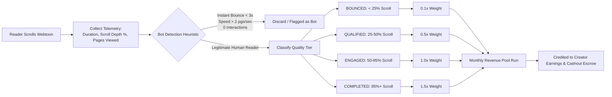

# 🎬 Comic BD — Complete System Architecture & 5-Minute LinkedIn Video Showcase

> **Target Video Duration:** Exactly 5:00 minutes (~700 spoken words at ~140 words/minute)  
> **Target Audience:** Engineering Hiring Managers, Tech Leads, Staff Engineers, and Recruiters  
> **Key Objective:** Demonstrate deep software engineering competence across **System Design, Database Modeling, Concurrency & ACID Ledgers, Telemetry Pipelines, and Performance Optimization**.

---

## 🏛️ PART 1: SYSTEM ARCHITECTURE & DATA FLOW DIAGRAMS

### Diagram 1: High-Level End-to-End System Architecture


---

### Diagram 2: Database Entity Relationship Diagram (ERD)


---

### Diagram 3: Atomic Concurrency & Chapter Unlock Ledger Flow

```mermaid
sequenceDiagram
    autonumber
    actor Reader as Reader Client
    participant API as Points / Chapter Service
    participant DB as PostgreSQL (Prisma $transaction)
    participant Creator as Creator Wallet

    Reader->>API: POST /api/v1/points/buy-chapter (chapterId)
    Note over API: Verify User Balance & Account Freeze Status
    
    rect rgb(20, 30, 45)
        Note over DB: BEGIN ATOMIC TRANSACTION
        API->>DB: 1. Deduct Points from Reader (decrement: cost)
        API->>DB: 2. Create PointTransaction (type: 'BUY_CHAPTER', amount: -cost)
        API->>DB: 3. Create ChapterPurchase (userId, chapterId)
        API->>DB: 4. Credit Creator Points (increment: cost)
        API->>DB: 5. Create Creator PointTransaction (type: 'BUY_CHAPTER', amount: +cost)
        API->>DB: 6. Increment CreatorProfile.totalEarnings
        Note over DB: COMMIT TRANSACTION (Rollback on any failure)
    end

    DB-->>API: Transaction Success
    API-->>Reader: 200 OK + Unlocked Chapter Image Payload
```


---

### Diagram 4: Reader Telemetry & Ad Revenue Quality Tier Pipeline


---

## ⏱️ PART 2: TIMED 5-MINUTE VIDEO SCRIPT (700 WORDS)

* **Speaker Tempo:** ~140 words per minute.
* **Format:** Left side is your exact verbal script; Right side is your exact on-screen visual action.

---

### 🕒 [0:00 – 0:45] SECTION 1: The Hook & High-Level Architecture (95 words)

| 🎙️ Verbal Voiceover Script | 🖥️ On-Screen Visual & Demo Action |
| :--- | :--- |
| "Hi everyone! Today I’m excited to present **Comic BD**—a production-ready, full-stack comic and webtoon publishing platform built to solve the real-world performance, telemetry, and monetization challenges in digital media.<br><br>I engineered this platform around a **Hybrid Monolith architecture**: Next.js 16 App Router on the frontend for lightning-fast Server-Side Rendering and dynamic OpenGraph SEO, coupled with a modular Express.js backend API gateway. This decoupling gives us sub-50-millisecond page loads while maintaining isolated, type-safe API services." | 1. **(0:00-0:15)** Start with your camera or screen showing the vibrant homepage hero carousel in dark mode.<br>2. **(0:15-0:30)** Display **Diagram 1 (System Architecture)** on screen.<br>3. **(0:30-0:45)** Switch to VS Code showing the folder layout: `src/app` (Next.js Server Components) alongside `server/app/modules/`. |

---

### 🕒 [0:45 – 1:35] SECTION 2: Database Schema & Financial Integrity (115 words)

| 🎙️ Verbal Voiceover Script | 🖥️ On-Screen Visual & Demo Action |
| :--- | :--- |
| "On the data layer, we leverage **PostgreSQL** modeled through **Prisma ORM**. When handling user wallets and currency exchanges, concurrency bugs like double-spending cannot happen.<br><br>Every point exchange, ad reward claim, and chapter unlock executes inside **atomic Prisma transactions (`$transaction`)**. In a single ACID unit of work, we deduct user points, record a double-entry ledger item in `PointTransaction`, write a unique purchase record, and credit creator studio earnings.<br><br>If any step fails, the entire transaction rolls back instantly, ensuring zero wallet drift and total financial integrity." | 1. **(0:45-1:05)** Display **Diagram 3 (Atomic Concurrency & Chapter Unlock Ledger Flow)**.<br>2. **(1:05-1:20)** Show `server/app/modules/points/points.service.ts` highlighting lines `160–208` (`prisma.$transaction([...])`).<br>3. **(1:20-1:35)** Open `prisma/schema.prisma` highlighting `PointTransaction`, `ChapterPurchase`, and `WithdrawalRequest`. |

---

### 🕒 [1:35 – 2:30] SECTION 3: Reader Telemetry & Revenue Share Algorithm (130 words)

| 🎙️ Verbal Voiceover Script | 🖥️ On-Screen Visual & Demo Action |
| :--- | :--- |
| "One of the most complex subsystems is our **Creator Revenue Distribution Engine**.<br><br>Rather than relying on naive page views that are easily gamed by bots, our webtoon reader streams engagement telemetry—tracking reading duration, scroll depth percentage, and interaction counts.<br><br>Our anti-bot heuristics automatically filter out rapid multi-page bounces and IP-farming sessions. Real reads are categorized into **four Quality Tiers**: Bounced, Qualified, Engaged, and Completed.<br><br>When the monthly ad revenue pool is calculated, weighted multipliers reward creators whose series achieve deep reader retention, not just superficial clicks. Creators can then request cashout withdrawals directly through an escrow-backed payout system." | 1. **(1:35-1:55)** Display **Diagram 4 (Reader Telemetry & Revenue Share Pipeline)**.<br>2. **(1:55-2:15)** Show `server/app/modules/adRevenue/adRevenue.service.ts` highlighting `evaluateBotDetection` and quality tier calculations.<br>3. **(2:15-2:30)** In the browser, navigate to the Dashboard **Revenue Distribution** page and show the run history table and distribution stats. |

---

### 🕒 [2:30 – 3:30] SECTION 4: Live Feature Demo & Localization (140 words)

| 🎙️ Verbal Voiceover Script | 🖥️ On-Screen Visual & Demo Action |
| :--- | :--- |
| "Let’s look at the live reader experience.<br><br>The **Webtoon Reader** offers an immersive reading mode with continuous vertical scroll, chapter jump shortcuts, and progress synchronization. Notice our **Multi-Language Switcher**: readers can switch between English, Bangla, Spanish, Hindi, Arabic, and Indonesian with instant translation filtering and flag badges.<br><br>Creators also have access to a full **Creator Studio**: they can set **Bulk Chapter Discounts**—such as 20% or 50% OFF—which dynamically updates chapter bundle unlock prices and automatically promotes the series to the homepage Bulk Discount carousel.<br><br>Uploading chapters includes multi-page drag-and-drop with real-time percentage progress bars and automated image optimization through Cloudinary." | 1. **(2:30-2:50)** Open `/series/solo-leveling/1`, scroll through webtoon images, toggle the reader settings sidebar.<br>2. **(2:50-3:05)** Click the Navbar language selector, switch to Bangla, and show the chapter list updated with Bangla badges.<br>3. **(3:05-3:20)** Show the Series Edit form with the **Bulk Chapter Discount pills** (`10%`, `20%`, `30%`, `50% OFF`).<br>4. **(3:20-3:30)** Return to the Homepage (`/`) and show the **Bulk Discounted Series** section. |

---

### 🕒 [3:30 – 4:25] SECTION 5: Performance, Security & Problem Solving (130 words)

| 🎙️ Verbal Voiceover Script | 🖥️ On-Screen Visual & Demo Action |
| :--- | :--- |
| "Let's discuss key engineering challenges solved during development:<br><br>**First, CSS Stacking Context Isolation**: In rich dashboards with sticky navigation, standard modal overlays often suffer from z-index bleed-through. I implemented React Portals (`createPortal`), mounting modals directly to `document.body` for pristine UI isolation.<br><br>**Second, Database Caching & Pagination**: Read-heavy catalog queries are cached in **Redis** with automated pattern-based invalidation upon writes. To prevent unbounded memory consumption, every GET data layer uses Prisma `skip`, `take`, and `count`, synchronized with reusable `<PaginationFooter />` UI components.<br><br>**Third, Security**: We enforce granular Role-Based Access Control, rate limiting across all auth routes, and raw payload verification on Stripe webhook ingest." | 1. **(3:30-3:50)** Show `ReportModal.tsx` and `FeedbackModal.tsx` in VS Code highlighting `createPortal(..., document.body)`.<br>2. **(3:50-4:10)** Open the Dashboard **Users** or **Series** table and demonstrate the `<PaginationFooter />` with smooth page switching.<br>3. **(4:10-4:25)** Show `server/app/middleware/rateLimiter.ts` and `server/index.ts` Stripe webhook raw body handling. |

---

### 🕒 [4:25 – 5:00] SECTION 6: Impact & Call to Action (90 words)

| 🎙️ Verbal Voiceover Script | 🖥️ On-Screen Visual & Demo Action |
| :--- | :--- |
| "In summary, Comic BD demonstrates end-to-end full-stack engineering: high-performance SSR, ACID database integrity, real-time telemetry processing, and production-grade security.<br><br>The live application is deployed on Render, and the full repository with comprehensive documentation is available on GitHub.<br><br>I am actively seeking **Full-Stack / Software Engineering roles** where I can build resilient, scalable distributed systems. Feel free to connect or reach out directly on LinkedIn. Thank you for watching!" | 1. **(4:25-4:40)** Show the GitHub repository with clean commit history, README, and documentation.<br>2. **(4:40-5:00)** Switch to your **Face on Camera** or LinkedIn profile page with your contact details visible. |

---

## 📱 PART 3: OPTIMIZED LINKEDIN POST COPY

```markdown
🚀 Excited to showcase my latest full-stack engineering project: Comic BD — an enterprise-grade webtoon publishing and creator monetization platform! 📚⚡

I built Comic BD to tackle the real-world scalability, telemetry, and payment integrity challenges of modern digital media platforms.

🏛️ Architectural & Engineering Highlights:
• Hybrid Next.js 16 (App Router / SSR) + Express.js API Gateway for sub-50ms TTFB and dynamic SEO indexing.
• PostgreSQL + Prisma ORM with atomic ACID transactions ($transaction) preventing double-spending on wallet points and bulk chapter unlocks.
• Redis In-Memory Caching with pattern-based cache evictions on write operations for read-heavy catalog performance.
• Quality-Tier Revenue Share Engine: Ingests real-time scroll telemetry (duration, scroll depth, interaction count) to calculate weighted monthly creator payouts.
• Distraction-Free Webtoon Reader: Infinite vertical scroll, reading progress persistence, and multi-language localization (EN, BN, ES, HI, AR, ID).
• Enterprise Security: 4-tier granular RBAC (Reader, Creator, Moderator, Admin), IP farming heuristic filters, and raw Stripe webhook ingest.

Watch the 5-minute video walkthrough below for a deep dive into the system design, ERD diagrams, and technical decisions!

🔗 Live Platform: https://comicbd.onrender.com/
💻 GitHub Repository: [Your GitHub URL Here]

💬 I am actively open to Full-Stack / Backend / Software Engineering opportunities. Let's connect!

#FullStack #Nextjs #Nodejs #TypeScript #PostgreSQL #Prisma #SystemDesign #SoftwareEngineering #WebDevelopment #OpenToWork #BackendEngineering
```

---

## 🎯 PART 4: RECORDING & PRESENTATION PRO-TIPS

1. **Window Setup:**
   * **Window 1 (Browser):** Open 3 tabs: (1) Homepage `/`, (2) Webtoon Reader `/series/solo-leveling/1`, (3) Creator Studio Dashboard `/dashboard`.
   * **Window 2 (VS Code):** Pin `prisma/schema.prisma`, `points.service.ts`, `adRevenue.service.ts`, and `PaginationFooter.tsx`.
2. **Diagrams:** Use Mermaid live preview or export the 4 diagrams above as clean SVGs/PNGs to display on screen during Sections 1, 2, and 3.
3. **Pacing:** Aim for ~140 words per minute. Practice with a phone timer once before recording.
