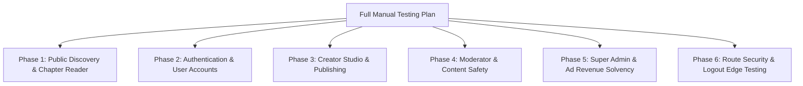

# Full Website End-to-End Manual Testing Plan

A complete, structured manual testing guide covering all user roles, reader flows, creator publishing, admin economy tools, security protections, and edge middleware.

---

## 🎯 Test Credentials & Personas

| Persona | Email | Password | Role | Primary Workspace |
| :--- | :--- | :--- | :--- | :--- |
| **Super Admin** | `admin@gmail.com` | `Admin123@` | `admin` | Full Website + Admin Tools (`/dashboard/*`) |
| **Creator** | *Create via Sign Up / Admin promotion* | *Your Password* | `creator` | Creator Studio (`/dashboard/series`, `/channel`) |
| **Reader (User)** | *Create via Sign Up* | *Your Password* | `user` | Consumer Reader (`/`, `/series`, `/profile`) |
| **Guest / Anonymous** | *Incognito Window (No cookie)* | N/A | `guest` | Public Catalog & Free Reader |

---

## 🗺️ Testing Flow Architecture

---

## 📋 Phase 1: Public Reader & Discovery (Guest / User)

### 1.1 Homepage (`/`)
- [ ] **Hero Section**: Check featured banner carousel auto-scroll, manual slide buttons, and "Read Now" CTA navigation.
- [ ] **Rankings & Popular**: Switch between "Daily", "Weekly", and "Monthly" tabs to confirm ranking updates.
- [ ] **Search Bar**: Type a series name in the global navbar search, test dropdown search suggestions, and press Enter to view search results.
- [ ] **Category Quick Filters**: Click genre chips (Action, Romance, Fantasy) to jump to filtered catalog.

### 1.2 Series Directory (`/series` & `/latest`)
- [ ] **Filter Controls**: Select genres, series types (Manga, Manhwa, Manhua), and status (Ongoing, Completed). Confirm list updates smoothly.
- [ ] **Sorting**: Sort by "Most Viewed", "Highest Rating", and "Latest Release".
- [ ] **Pagination**: Navigate through pages and verify chapter counts on cards.

### 1.3 Series Details Page (`/series/[slug]`)
- [ ] **Synopsis & Metadata**: Verify cover image, genres, release status, rating stars, and creator channel link.
- [ ] **Bookmark Toggle**: Click bookmark button (as logged-in user) and verify count increment and library sync.
- [ ] **Chapter List**: Verify chapter list ordering (Ascending / Descending toggle), release dates, and lock/free badges.

### 1.4 Chapter Reader (`/series/[slug]/[chapterNumber]`)
- [ ] **Reading Modes**: Test continuous vertical webtoon scroll vs single-page presentation.
- [ ] **Chapter Navigation**: Test "Next Chapter" and "Previous Chapter" buttons at the top and bottom of the reader.
- [ ] **Telemetry Heartbeat**: Scroll through the chapter for >30 seconds. Verify the reading progress bar fills up.
- [ ] **Comments & Reactions**:
  - [ ] Post a comment on the chapter.
  - [ ] Like an existing comment.
  - [ ] Post a threaded reply to a comment.
- [ ] **Public Creator Channel Link**: Click the author/creator link to navigate to `/channel/[id]`.

### 1.5 Public Information Pages
- [ ] Test [`/about`](file:///e:/New%20folder/Code/comic/src/app/(public)/about/page.tsx), [`/contact`](file:///e:/New%20folder/Code/comic/src/app/(public)/contact/page.tsx), [`/creator-benefits`](file:///e:/New%20folder/Code/comic/src/app/(public)/creator-benefits/page.tsx), [`/terms`](file:///e:/New%20folder/Code/comic/src/app/(public)/terms/page.tsx), [`/privacy`](file:///e:/New%20folder/Code/comic/src/app/(public)/privacy/page.tsx), and [`/dmca`](file:///e:/New%20folder/Code/comic/src/app/(public)/dmca/page.tsx).

---

## 👤 Phase 2: Authentication & User Accounts

### 2.1 Registration & Login
- [ ] **User Registration**: Sign up with a new email and password.
- [ ] **Email Verification**: Check email inbox (or terminal console in dev mode) for the verification link; visit [`/verify-email?token=...`](file:///e:/New%20folder/Code/comic/src/app/(public)/verify-email/page.tsx) and confirm activation.
- [ ] **Password Reset**: Click "Forgot Password" on login dialog; check email/console for token link; enter a new password on [`/reset-password`](file:///e:/New%20folder/Code/comic/src/app/(public)/reset-password/page.tsx) and verify login with the new password.
- [ ] **Duplicate / IP Guard**: Attempt to register multiple accounts rapidly to verify IP signup limit protections.

### 2.2 User Library & Profile
- [ ] **My Profile ([`/profile`](file:///e:/New%20folder/Code/comic/src/app/(public)/profile/page.tsx))**:
  - [ ] Update display name and avatar image.
  - [ ] Copy unique referral link and invite code.
  - [ ] View points balance and account creation date.
- [ ] **Bookmarks ([`/bookmarks`](file:///e:/New%20folder/Code/comic/src/app/(public)/bookmarks/page.tsx))**:
  - [ ] Verify bookmarked series appear with last-read chapter indicators.
  - [ ] Remove a bookmark and confirm instant removal.
- [ ] **Reading History ([`/history`](file:///e:/New%20folder/Code/comic/src/app/(public)/history/page.tsx))**:
  - [ ] Verify read chapters appear in chronological order with exact progress percentages.
  - [ ] Click "Continue Reading" on a history card.
  - [ ] Click "Clear History" to wipe recorded reading logs.

### 2.3 Economy, Shop & Transactions
- [ ] **Coin Shop ([`/shop`](file:///e:/New%20folder/Code/comic/src/app/(public)/shop/page.tsx))**:
  - [ ] Select a Coin/Point package.
  - [ ] Open Stripe sandbox checkout and complete a test payment.
  - [ ] Verify points balance increases instantly in Navbar and Profile.
- [ ] **Transactions Ledger ([`/transactions`](file:///e:/New%20folder/Code/comic/src/app/(public)/transactions/page.tsx))**:
  - [ ] Verify purchase transaction is logged with Stripe payment intent ID.
  - [ ] Unlock a premium chapter and verify point deduction entry in the ledger.
- [ ] **Rewards Hub ([`/rewards`](file:///e:/New%20folder/Code/comic/src/app/(public)/rewards/page.tsx))**:
  - [ ] Enter a creator promo code and verify bonus points credited.

---

## 🎨 Phase 3: Creator Studio (`/dashboard` for Creator)

### 3.1 Top Navbar & Navigation
- [ ] **Search Bar**: Search for a series from the top navbar and verify instant navigation to filtered `/dashboard/series?search=<query>`.
- [ ] **"+ Create Series" Button**: Click the top navbar CTA button and verify redirect to `/dashboard/series/add`.
- [ ] **Notification Bell**: Open the bell popover, view recent notifications, and test "Mark all as read".
- [ ] **User Dropdown**: Test navigation to "Return to Website", "My Profile", and "Channel Profile".

### 3.2 Series Management (`/dashboard/series`)
- [ ] **Create Series ([`/dashboard/series/add`](file:///e:/New%20folder/Code/comic/src/app/dashboard/series/add/page.tsx))**:
  - [ ] Upload series cover, enter Title, Synopsis, select Genres, and choose Type/Status.
  - [ ] Submit and verify new series appears in creator's list.
- [ ] **Edit Series ([`/dashboard/series/edit/[id]`](file:///e:/New%20folder/Code/comic/src/app/dashboard/series/edit/[id]/page.tsx))**:
  - [ ] Modify synopsis and save. Verify updates reflect on the public page.
- [ ] **Featured Request Modal**: Click "Request Feature" on a series card, select duration (e.g. 7 days), and submit request with pitch notes.

### 3.3 Chapter Management (`/dashboard/chapters`)
- [ ] **Upload New Chapter ([`/dashboard/chapters/add`](file:///e:/New%20folder/Code/comic/src/app/dashboard/chapters/add/page.tsx))**:
  - [ ] Select series, enter Chapter Number and Title.
  - [ ] Upload pages via drag-and-drop or ZIP archive.
  - [ ] Set unlock point price (e.g. `0` for free, `50` for premium).
  - [ ] Publish chapter and verify it becomes readable on the public series page.

### 3.4 Creator Channel & Marketing
- [ ] **Channel Profile ([`/dashboard/channel`](file:///e:/New%20folder/Code/comic/src/app/dashboard/channel/page.tsx))**:
  - [ ] Upload channel banner image, customize creator bio, and add Twitter/Discord links.
  - [ ] View public channel (`/channel/[id]`) and verify branding.
- [ ] **Promo Codes ([`/dashboard/promos`](file:///e:/New%20folder/Code/comic/src/app/dashboard/promos/page.tsx))**:
  - [ ] Create a promo code with custom discount points, max uses, and expiry date.

### 3.5 Earnings & Withdrawals
- [ ] **Earnings Overview ([`/dashboard/earnings`](file:///e:/New%20folder/Code/comic/src/app/dashboard/earnings/page.tsx))**:
  - [ ] Verify chapter unlock earnings and ad revenue quality pool allocations.
- [ ] **Request Cashout ([`/dashboard/cashout`](file:///e:/New%20folder/Code/comic/src/app/dashboard/cashout/page.tsx))**:
  - [ ] Submit a withdrawal request for points to USD (PayPal / Bank Transfer).
  - [ ] Confirm request enters pending queue.

---

## 🛡️ Phase 4: Moderator Queue (`/dashboard` for Moderator)

### 4.1 Series Applications ([`/dashboard/applications`](file:///e:/New%20folder/Code/comic/src/app/dashboard/applications/page.tsx))
- [ ] Review submitted series applications.
- [ ] Test **Approve** (series goes public) and **Reject** (with review notes).

### 4.2 Content & Comment Moderation
- [ ] **User Reports ([`/dashboard/reports`](file:///e:/New%20folder/Code/comic/src/app/dashboard/reports/page.tsx))**:
  - [ ] Review reported chapters or comments.
  - [ ] Mark report as `RESOLVED` or `DISMISSED`.
- [ ] **Comments Moderation ([`/dashboard/comments`](file:///e:/New%20folder/Code/comic/src/app/dashboard/comments/page.tsx))**:
  - [ ] Moderate and delete inappropriate comments.

### 4.3 Catalog & User Safety
- [ ] **Admin Series Moderation ([`/dashboard/admin-series`](file:///e:/New%20folder/Code/comic/src/app/dashboard/admin-series/page.tsx))**:
  - [ ] Hide a series with reason (e.g. "Copyright infringement").
  - [ ] Verify hidden series is removed from public search and catalog.
- [ ] **User Management ([`/dashboard/users`](file:///e:/New%20folder/Code/comic/src/app/dashboard/users/page.tsx))**:
  - [ ] Search user by email or name.
  - [ ] Freeze / Unfreeze user points ledger.
  - [ ] Ban / Unban user account.

---

## 👑 Phase 5: Super Admin Tools & Ad Revenue Solvency

### 5.1 Ad Revenue Distribution Engine ([`/dashboard/revenue-distribution`](file:///e:/New%20folder/Code/comic/src/app/dashboard/revenue-distribution/page.tsx))
- [ ] **SSR History Verification**: Navigate to the page. Confirm past distribution runs load immediately without clicking "Refetch History".
- [ ] **Solvency 3-Step Preview Calculation**:
  - [ ] Select Date Range (e.g. Last Month) and enter Amount `$1,000 USD`.
  - [ ] Click **Calculate Preview**.
  - [ ] **Verify 3-Step Solvency Banner**:
    - Step 1: Gross Ad Revenue points ($100,000\text{ pts}$)
    - Step 2: Creator Wallet Reserve deducted ($-\sum \text{creator points}$)
    - Step 3: Net Distributable Quality Pool ($=\text{Gross} - \text{Reserve}$)
  - [ ] Check itemized creator score breakdown table and points allocation.
- [ ] **Execute Distribution Run**:
  - [ ] Click **Confirm & Distribute Points**.
  - [ ] Review summary modal and add audit notes.
  - [ ] Click **Execute & Credit Points**.
  - [ ] Verify creator point balances receive net surplus points while existing balances remain intact.
- [ ] **Revert / Rollback Run**:
  - [ ] Click **Revert** on a completed run in the history table.
  - [ ] Type `"REVERT"` confirmation and execute rollback.
  - [ ] Verify distributed points are safely deducted and run status updates to `REVERTED`.

### 5.2 System Settings & Infrastructure
- [ ] **Payments Audit ([`/dashboard/payments`](file:///e:/New%20folder/Code/comic/src/app/dashboard/payments/page.tsx))**: Verify Stripe payment ledger.
- [ ] **Staff Roles ([`/dashboard/roles`](file:///e:/New%20folder/Code/comic/src/app/dashboard/roles/page.tsx))**: Promote a user to `moderator` or `creator`.
- [ ] **Site Settings ([`/dashboard/settings`](file:///e:/New%20folder/Code/comic/src/app/dashboard/settings/page.tsx))**: Update App Name, Point-to-Fiat rate, AdSense Client ID, or toggle Maintenance Mode.
- [ ] **Custom Ads Manager ([`/dashboard/ads`](file:///e:/New%20folder/Code/comic/src/app/dashboard/ads/page.tsx))**: Create banner and interstitial ad units.
- [ ] **Database Backup ([`/dashboard/backup`](file:///e:/New%20folder/Code/comic/src/app/dashboard/backup/page.tsx))**: Export database JSON backup.
- [ ] **Audit Logs ([`/dashboard/audit`](file:///e:/New%20folder/Code/comic/src/app/dashboard/audit/page.tsx))**: Verify staff actions and IP audit trails.

---

## 🔒 Phase 6: Edge Route Security & Logout Redirection

### 6.1 Unauthenticated Edge Protection
Open a new **Incognito / Private Window** (no cookie):
- [ ] Try navigating directly to [`/profile`](file:///e:/New%20folder/Code/comic/src/app/(public)/profile/page.tsx) $\rightarrow$ Verify immediate redirect to `/?login=true`.
- [ ] Try navigating directly to [`/bookmarks`](file:///e:/New%20folder/Code/comic/src/app/(public)/bookmarks/page.tsx) $\rightarrow$ Verify immediate redirect to `/?login=true`.
- [ ] Try navigating directly to [`/history`](file:///e:/New%20folder/Code/comic/src/app/(public)/history/page.tsx) $\rightarrow$ Verify immediate redirect to `/?login=true`.
- [ ] Try navigating directly to [`/transactions`](file:///e:/New%20folder/Code/comic/src/app/(public)/transactions/page.tsx) $\rightarrow$ Verify immediate redirect to `/?login=true`.
- [ ] Try navigating directly to [`/dashboard`](file:///e:/New%20folder/Code/comic/src/app/dashboard/page.tsx) $\rightarrow$ Verify immediate redirect to `/creator-benefits`.

### 6.2 Role-Based Edge Access Control
- [ ] Log in as normal reader (`user` role) and navigate to `/dashboard` $\rightarrow$ Verify redirect to `/creator-benefits`.
- [ ] Log in as Creator (`creator` role) and navigate to `/dashboard/revenue-distribution` or `/dashboard/settings` $\rightarrow$ Verify redirect to `/dashboard`.
- [ ] Log in as Moderator (`moderator` role) and navigate to `/dashboard/revenue-distribution` $\rightarrow$ Verify redirect to `/dashboard`.

### 6.3 Real-Time Logout Redirection
- [ ] While logged in on [`/profile`](file:///e:/New%20folder/Code/comic/src/app/(public)/profile/page.tsx), click **Sign Out** $\rightarrow$ Verify immediate hard redirect to `/`.
- [ ] While logged in on [`/bookmarks`](file:///e:/New%20folder/Code/comic/src/app/(public)/bookmarks/page.tsx), click **Sign Out** $\rightarrow$ Verify immediate hard redirect to `/`.
- [ ] While logged in on [`/dashboard/series`](file:///e:/New%20folder/Code/comic/src/app/dashboard/series/page.tsx), click **Log Out** from the top header $\rightarrow$ Verify immediate hard redirect to `/`.
- [ ] While logged in on [`/series`](file:///e:/New%20folder/Code/comic/src/app/(public)/series/page.tsx), click **Sign Out** $\rightarrow$ Verify session clears and navbar updates to guest state without leaving the page.
